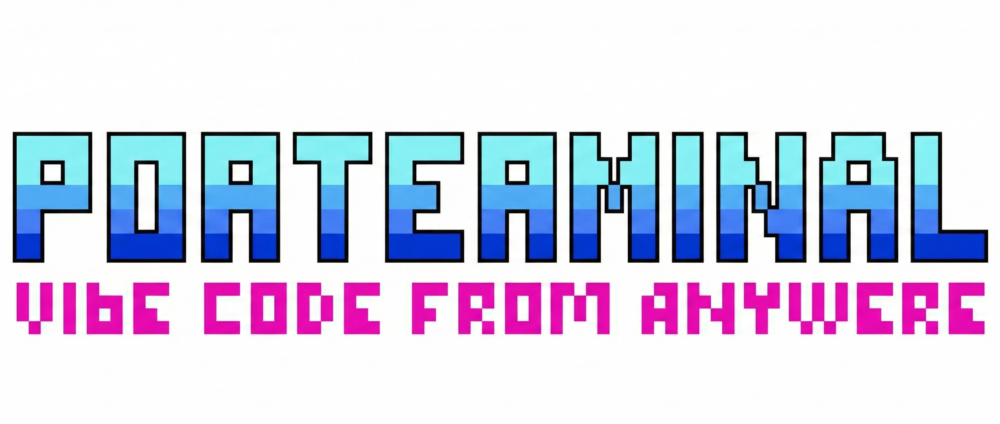

<p align="center">
  <a href="https://github.com/lyehe/porterminal">
    
  </a>
</p>

<p align="center">
  <a href="https://pypi.org/project/ptn/">
    
  </a>
  <a href="https://pypi.org/project/ptn/">
    
  </a>
  <a href="https://pypi.org/project/ptn/">
    
  </a>
  <a href="https://github.com/lyehe/porterminal/blob/main/LICENSE">
    
  </a>
</p>


<p align="center">
  <b>1.</b> <code>uvx ptn</code><br>
  <b>2.</b> Scan the QR<br>
  <b>3.</b> Access your terminal from your phone<br>
</p>

<p align="center">
  <video src="assets/demo.mp4" width="600" controls></video>
</p>

---

## Why

I wanted to vibe code from bed. ngrok requires registration and the free tier sucks. Cloudflare Quick Tunnel works great but is hard to use directly on the phone. Termius works after complicated setup: port forwarding, firewall rules, key management... I just wanted something simpler: run a command, scan a QR, start typing.

## Features

- **One command, instant access** - No SSH, no port forwarding, no config files. Cloudflare tunnel + QR code.
- **Actually usable on mobile** - Essential buttons and gestures for everyday terminal use.
- **Multi-tab shared sessions** - Run builds in one tab, tail logs in another. Sessions persist across reconnects.
- **Cross-platform** - Windows (PowerShell, CMD, WSL), Linux/macOS (Bash, Zsh, Fish). Auto-detects your shells.
- **Update notifications** - Checks PyPI daily, notifies on startup if update available. Run `ptn -U` to update.

## Install

| Method | Install | Update |
|--------|---------|--------|
| **uvx** (no install) | `uvx ptn` | `uvx --refresh ptn` |
| **uv tool** | `uv tool install ptn` | `uv tool upgrade ptn` |
| **pipx** | `pipx install ptn` | `pipx upgrade ptn` |
| **pip** | `pip install ptn` | `pip install -U ptn` |

Requires Python 3.12+ and [cloudflared](https://developers.cloudflare.com/cloudflare-one/connections/connect-networks/downloads/) (auto-installed if missing).

## Usage

```bash
ptn                    # Start in current directory
ptn ~/projects/myapp   # Start in specific folder
ptn --no-tunnel        # Local network only
ptn -b                 # Run in background
ptn --init             # Create .ptn/ptn.yaml config
ptn -U                 # Update to latest version
ptn --check-update     # Check if update available
```

## Configuration

Run `ptn --init` to create a starter config, or create `ptn.yaml` manually:

```yaml
# Custom buttons (appear in toolbar)
buttons:
  - label: "claude"
    send:
      - "claude"
      - 100        # delay in ms
      - "\r"
  - label: "tmux"
    send: "tmux\r"

# Update checker settings
update:
  notify_on_startup: true   # Show update notification
  check_interval: 86400     # Seconds between checks (default: 24h)
```

Config is searched in order: `$PORTERMINAL_CONFIG_PATH`, `./ptn.yaml`, `./.ptn/ptn.yaml`, `~/.ptn/ptn.yaml`.

## Security

> **Warning:** The URL is the only authentication. Anyone with the link has full terminal access.

- Don't share the URL
- Stop the server when not in use (`Ctrl+C`)
- Use `--no-tunnel` for local network only
- Environment variables are sanitized (API keys, tokens stripped)

## Contributing

Issues and PRs welcome.

```bash
git clone https://github.com/lyehe/porterminal
cd porterminal
uv sync
uv run ptn
```

## License

[AGPL-3.0](LICENSE)
