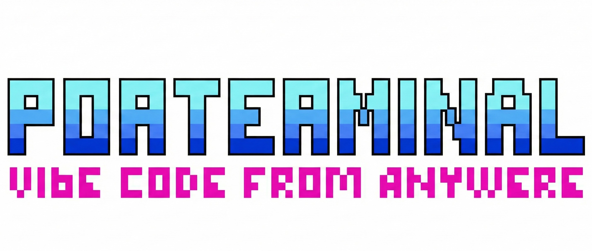

<p align="center">
  <a href="https://github.com/lyehe/porterminal">
    
  </a>
</p>

<p align="center">
  <a href="https://pypi.org/project/ptn/"></a>
  <a href="https://pypi.org/project/ptn/"></a>
  <a href="https://pypi.org/project/ptn/"></a>
  <a href="https://github.com/lyehe/porterminal/blob/master/LICENSE"></a>
  <a href="https://github.com/lyehe/porterminal/actions/workflows/ci.yml"></a>
</p>


<p align="center">
  <b>A web terminal you reach from your phone — or hand to an AI agent.</b><br>
  One command, one URL.
</p>

<p align="center">
  <b>1.</b> <code>uvx ptn</code><br>
  <b>2.</b> Scan the QR from your phone — or give the URL to an AI agent (MCP)<br>
  <b>3.</b> Drive your terminal from anywhere<br>
</p>

<p align="center">
  
</p>

> [!WARNING]
> **That URL is full access to this computer.** Anyone — or any AI agent — you hand it to gets a real shell on your machine, no password. That's the whole point, but it's dangerously easy to give an agent more than you meant to. Treat the URL like a secret, only share it with people and agents you trust, and read [Security](#security) before you point it at anything important.

## Why

I wanted to vibe code from bed.

**ngrok** requires registration and the free tier sucks. **Cloudflare Quick Tunnel** works great but is hard to use directly on the phone. **Termius** requires complicated setup: port forwarding, firewall rules, key management... Tried **Claude Code web**, but it can't access my local hardware and environment. Also tried **Happy**, but it's too bulky and updates lag behind.

So I built something simpler: **run a command, scan a QR, start typing.**

## Features

- **One command, instant access** - No SSH, no port forwarding, no config files. Cloudflare tunnel + QR code.
- **Actually usable on mobile** - Touch-optimized with momentum scrolling, pinch-to-zoom, swipe gestures, and modifier keys (Ctrl, Alt).
- **Full terminal apps** - vim, htop, less, tmux all work correctly with proper alt-screen buffer handling.
- **Persistent multi-tab sessions** - Sessions survive disconnects. Close the browser, switch networks, reconnect from another device—your shell and running processes are still there. Multiple devices can view the same session simultaneously.
- **Cross-platform** - Windows (PowerShell, CMD, WSL), Linux/macOS (Bash, Zsh, Fish, Nushell, and any shell via `$SHELL`). Auto-detects your shells.
- **Private by default** - The secret tunnel URL never sits on screen, so it's safe to screen-share or screenshot the QR. Press `c` to copy the URL when you need it.
- **Agent-ready (MCP)** - The same URL an AI agent can drive: an MCP terminal at `/mcp` lets any MCP client run commands, read the screen, and answer prompts. Agents discover how to use it from `/llms.txt`. See [Agent access (MCP)](#agent-access-mcp).

## Install

| Method | Install | Update |
|--------|---------|--------|
| **uvx** (no install) | `uvx ptn` | `uvx --refresh ptn` |
| **uv tool** | `uv tool install ptn` | `uv tool upgrade ptn` |
| **pipx** | `pipx install ptn` | `pipx upgrade ptn` |
| **pip** | `pip install ptn` | `pip install -U ptn` |

**One-line install (uv + ptn):**

| OS | Command |
|----|---------|
| **Windows** | `powershell -ExecutionPolicy ByPass -c "irm https://raw.githubusercontent.com/lyehe/porterminal/master/install.ps1 \| iex"` |
| **macOS/Linux** | `curl -LsSf https://raw.githubusercontent.com/lyehe/porterminal/master/install.sh \| sh` |

Requires Python 3.12+ and [cloudflared](https://developers.cloudflare.com/cloudflare-one/connections/connect-networks/downloads/) (auto-installed if missing).

## Usage

```bash
ptn                    # Start in current directory
ptn ~/projects/myapp   # Start in specific folder
```

| Flag | Description |
|------|-------------|
| `-n, --no-tunnel` | Local network only (no Cloudflare tunnel) |
| `-b, --background` | Run in background and return immediately |
| `-p, --password` | Prompt for password to protect this session |
| `-sp, --save-password` | Save or clear password in config |
| `-tp, --toggle-password` | Set password requirement (on/off/toggle) |
| `-v, --verbose` | Show detailed startup logs |
| `-i, --init` | Create `.ptn/ptn.yaml` with auto-discovered project scripts as buttons |
| `-if, --init-from URL/PATH` | Create `.ptn/ptn.yaml` from a URL or local file |
| `-c, --compose` | Enable compose mode by default |
| `-k, --keep-qr` | Keep the QR code visible after the first connection |
| `-u, --check-update` | Check if a newer version is available |
| `-V, --version` | Show version |

**While running:** with a tunnel active, the connection URL is hidden on screen for privacy — press **`c`** to copy it to your clipboard, or scan the QR to connect. `Ctrl+C` stops the server.

## Agent access (MCP)

The same URL also works for AI agents. Porterminal serves a Model Context Protocol (MCP) terminal at **`<url>/mcp`** (Streamable HTTP) — point any MCP-capable client (Claude, Cursor, etc.) at it and the agent gets its own persistent shell, shown as a 🤖 tab you can watch and take over from your phone.

Hand the agent the tunnel URL. MCP clients can auto-discover the server from **`<url>/.well-known/mcp.json`** (the MCP `server.json` descriptor), and there's a human/agent-readable **`<url>/llms.txt`** with usage — both linked invisibly from the page, so the human UI is unchanged. Example client config:

```json
{
  "mcpServers": {
    "porterminal": { "url": "https://<your-tunnel>.trycloudflare.com/mcp" }
  }
}
```

Tools: `run_command` (clean output + exit code), `read_screen`, `send_keys`, `send_signal` (Ctrl-C / EOF).

> **Security:** like the human terminal, the only protection is the secret tunnel URL — anyone (or any agent) with it gets full, non-elevated shell access. If you need real auth, use a different tool. See [docs/agent-access.md](docs/agent-access.md).

## Mobile Gestures

| Gesture | Action |
|---------|--------|
| **Tap** | Focus terminal, clear selection |
| **Long-press** | Start text selection |
| **Double-tap** | Select word |
| **Swipe left/right** | Arrow keys (← →) |
| **Scroll** | Momentum scrolling with physics |
| **Pinch** | Zoom text (10-24px) |

**Modifier keys** (Ctrl, Alt, Shift): Tap once for sticky (one keystroke), double-tap for lock.

**Compose mode** (▤ button): Toggle a text input field where you can type or dictate, edit your text with full mobile editing features (autocorrect, suggestions, cursor positioning), then send to terminal. Useful for longer commands or voice input.

## Configuration

Run `ptn --init` to create a starter config. It auto-discovers project scripts from `package.json`, `pyproject.toml`, or `Makefile` and adds them as buttons:

```bash
ptn -i
# Created: .ptn/ptn.yaml
# Discovered 3 project script(s): build, dev, test
```

Or create `ptn.yaml` manually:

```yaml
# Terminal settings
terminal:
  default_shell: nu              # Default shell ID
  shells:                        # Custom shell definitions
    - id: nu
      name: Nushell
      command: nu
      args: []

# Custom buttons (appear in toolbar)
# row: 1 = default row, 2+ = additional rows
buttons:
  - label: "claude"
    send:
      - "claude"
      - 100        # delay in ms
      - "\r"
  - label: "build"
    send: "npm run build\r"
    row: 2         # second button row

# Update checker settings
update:
  notify_on_startup: true   # Show update notification
  check_interval: 86400     # Seconds between checks (default: 24h)

# Security settings
security:
  require_password: true    # Always require password at startup
  password_hash: ""         # Saved password hash (use ptn -sp to set)
  max_auth_attempts: 5      # Max failed attempts before disconnect
```

Config is searched in order: `$PORTERMINAL_CONFIG_PATH`, `./ptn.yaml`, `./.ptn/ptn.yaml`, `~/.ptn/ptn.yaml`.

## Security

**There's no password by default** — the only thing stopping anyone is that they can't guess the random tunnel URL. Anyone (or any AI agent) who gets it has a full shell on your machine. Don't expose anything you wouldn't hand to a stranger, and set a password for anything sensitive:

**From the UI:** Open Settings (gear icon) and use the Security section to set/change password and toggle password requirement. Changes require server restart.

**From CLI:**

```bash
# One-time password (prompt each session)
ptn -p

# Save password to config (no prompt needed)
ptn -sp
# Password: ****
# Confirm password: ****

# Clear saved password (enter empty password)
ptn -sp
# Password: [press Enter]

# Set or toggle password requirement
ptn -tp on       # Enable
ptn -tp off      # Disable
ptn -tp toggle   # Toggle current state
```

See [docs/security.md](docs/security.md) for details.

## Troubleshooting

**Connection fails?** Cloudflare tunnel sometimes blocks connections. Restart the server (`Ctrl+C`, then `ptn`) to get a fresh tunnel URL.

**Shell not detected?** Set your `$SHELL` environment variable or configure shells in `ptn.yaml`.

## Contributing

**This project does not accept external contributions** (pull requests or code
changes) for security reasons — see [CONTRIBUTING.md](CONTRIBUTING.md). You're
welcome to fork and run your own copy under [AGPL-3.0](LICENSE).

Run from source:

```bash
git clone https://github.com/lyehe/porterminal
cd porterminal
uv sync
uv run ptn
```

## License

[AGPL-3.0](LICENSE)
